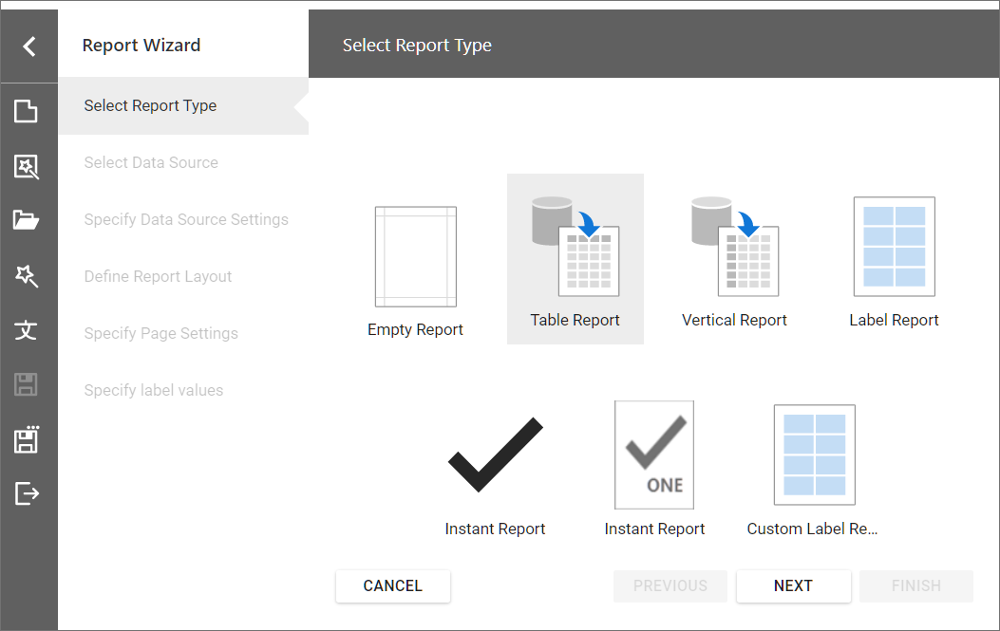
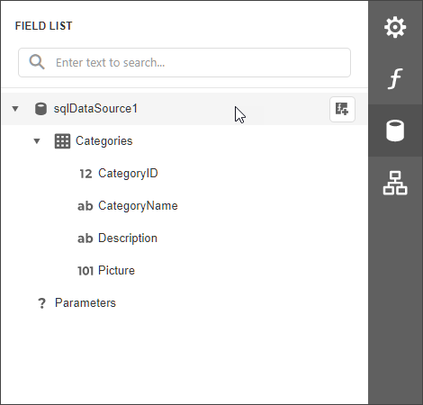

<!-- default badges list -->

<!-- default badges end -->
# Reporting for Web (ASP.NET MVC, ASP.NET Core and Angular) - How to Use the Report Wizard Customization API and Hide Data Source Actions in Report Designer

This example shows how to add a custom report template to the Report Wizard and make final adjustments to the report you are creating. The Report designer is configured to hide data source actions so that the user cannot add, modify, or delete the report data source.

The example includes separate projects for ASP.NET MVC, ASP.NET Core and Angular client application with ASP.NET Core backend.

The implementation is based on the following classes:
 
- The [ReportWizardCustomizationService](https://docs.devexpress.com/XtraReports/DevExpress.XtraReports.Web.ReportDesigner.Services.ReportWizardCustomizationService) class descendant is implemented and registered as a service to customize the Report Wizard.

- The [ReportDesignerDataSourceSettings](https://docs.devexpress.com/XtraReports/DevExpress.XtraReports.Web.ReportDesigner.ReportDesignerDataSourceSettings) class contains settings that allow you to hide data source actions from the Field List panel.
 
After you run the application, invoke the **Report Wizard** to see a new `Instant Report` template:

In the Report Designer, switch to the **Field List** panel to make sure that data source actions are hidden:

## Files to Review

### Service that Customizes the Report Wizard

- [InstantReportWizardCustomizationService.cs](Mvc/ReportWizardCustomizationServiceMvcExample/Services/InstantReportWizardCustomizationService.cs)

### Service Registration

- ASP.NET MVC: [Global.asax.cs](Mvc/ReportWizardCustomizationServiceMvcExample/Global.asax.cs)
- ASP.NET Core: [Startup.cs](AspNetCore/ReportWizardCustomizationServiceAspNetCoreExample/Startup.cs)

### Report Designer Data Source Settings

- ASP.NET MVC: [Designer.cshtml](Mvc/ReportWizardCustomizationServiceMvcExample/Views/Home/Designer.cshtml)
- ASP.NET Core: [HomeController.cs](AspNetCore/ReportWizardCustomizationServiceAspNetCoreExample/Controllers/HomeController.cs)
- Angular: [report-designer.html](Angular/ReportWizardCustomizationServiceAngularExample/ClientApp/src/app/reportdesigner/report-designer.html)

## Documentation

- [ReportWizardCustomizationService](https://docs.devexpress.com/XtraReports/DevExpress.XtraReports.Web.ReportDesigner.Services.ReportWizardCustomizationService)
- [ReportDesignerDataSourceSettings](https://docs.devexpress.com/XtraReports/DevExpress.XtraReports.Web.ReportDesigner.ReportDesignerDataSourceSettings)

