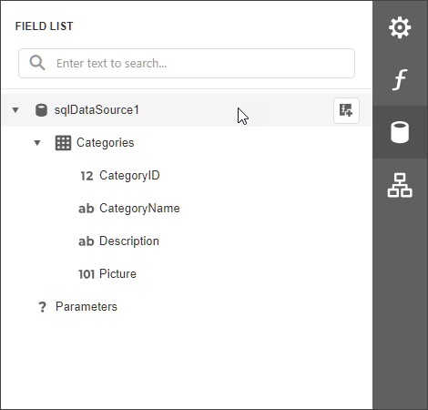

<!-- default badges list -->

<!-- default badges end -->
# Reporting for Web (ASP.NET MVC, ASP.NET Core and Angular) - How to Customize the DevExpress Report Wizard Customization and Hide Data Source Actions within our Report Designer

For more information on the capabilities outlined in this example (or if you are new to DevExpress Reports), please review the following blog post for important background information: [DevExpress Web Report Designer — Custom Report Templates within the Report Wizard, Data Source UI Enhancements (v22.2)](https://community.devexpress.com/blogs/reporting/archive/2023/03/02/devexpress-web-report-designer-enhancements-in-v22-2.aspx)

DevExpress Reports ships with an easy-to-use/flexible Report Wizard.  You can use the Report Wizard to generate reports yourself or make it available to end users (minimize development costs/maximize productivity). This example will show you how to add a custom report template to the Report Wizard and make modifications to a wizard-generated report. Our sample project includes separate projects for ASP.NET MVC, ASP.NET Core, and Angular client application with an ASP.NET Core backend.

To customize the DevExpress Report Wizard and add new wizard report templates (this example adds Instant Report and Custom Label Report templates to our default template list), you must:
 
- Implement a descendant of the [ReportWizardCustomizationService](https://docs.devexpress.com/XtraReports/DevExpress.XtraReports.Web.ReportDesigner.Services.ReportWizardCustomizationService) class and register it as a service.
- Handle the Report Designer `CustomizeWizard` event to register a custom wizard page. (the `reportWizardCustomization.js` file contains JavaScript code required for registration).

By customizing our wizard’s default template set, you can address a variety of usage scenarios. To see what’s possible, execute the app, invoke the **Report Wizard**, and select a custom template included with this demo (`Instant Report` and `Custom Label Report`).

To hide data source action from our Report Designer’s Field List panel, you must:

- Use the following class: [ReportDesignerDataSourceSettings](https://docs.devexpress.com/XtraReports/DevExpress.XtraReports.Web.ReportDesigner.ReportDesignerDataSourceSettings).

> **Note**
> To help illustrate available options, the Report Designer was configured to hide data source actions. As such, users cannot add, modify, or delete the data source used for this report.

Once you generate a wizard-based report, switch to the **Field List** panel. Notice that data source actions have been hidden (via [ReportDesignerDataSourceSettings](https://docs.devexpress.com/XtraReports/DevExpress.XtraReports.Web.ReportDesigner.ReportDesignerDataSourceSettings)).

## Files to Review

### Service that Customizes the Report Wizard

- [InstantReportWizardCustomizationService.cs](Mvc/ReportWizardCustomizationServiceMvcExample/Services/InstantReportWizardCustomizationService.cs)

### Service Registration

- ASP.NET MVC: [Global.asax.cs](Mvc/ReportWizardCustomizationServiceMvcExample/Global.asax.cs)
- ASP.NET Core: [Startup.cs](AspNetCore/RWCSAspNetCoreExample/Startup.cs)

### Custom Wizard Page for the Custom Label Report

- ASP.NET MVC: [Designer.cshtml](Mvc/ReportWizardCustomizationServiceMvcExample/Views/Home/Designer.cshtml)
- ASP.NET Core: [Designer.cshtml](AspNetCore/RWCSAspNetCoreExample/Views/Home/Designer.cshtml)
- Angular: [report-designer.html](Angular/RWCSAngularExample/ClientApp/src/app/reportdesigner/report-designer.html) and[report-designer.ts](Angular/RWCSAngularExample/ClientApp/src/app/reportdesigner/report-designer.ts)
- [reportWizardCustomization.js](Mvc/ReportWizardCustomizationServiceMvcExample/Scripts/reportWizardCustomization.js)
- [LabelReport.cs](Mvc/ReportWizardCustomizationServiceMvcExample/PredefinedReports/LabelReport.cs)

### Report Designer Data Source Settings

- ASP.NET MVC: [Designer.cshtml](Mvc/ReportWizardCustomizationServiceMvcExample/Views/Home/Designer.cshtml)
- ASP.NET Core: [HomeController.cs](AspNetCore/RWCSAspNetCoreExample/Controllers/HomeController.cs)
- Angular: [report-designer.html](Angular/RWCSAngularExample/ClientApp/src/app/reportdesigner/report-designer.html)

## Documentation

- [ReportWizardCustomizationService](https://docs.devexpress.com/XtraReports/DevExpress.XtraReports.Web.ReportDesigner.Services.ReportWizardCustomizationService)
- [ReportDesignerDataSourceSettings](https://docs.devexpress.com/XtraReports/DevExpress.XtraReports.Web.ReportDesigner.ReportDesignerDataSourceSettings)
- [Customize the Report/Data Source Wizard (ASP.NET MVC)](https://docs.devexpress.com/XtraReports/401087/web-reporting/asp-net-mvc-reporting/end-user-report-designer-in-asp-net-mvc-applications/customization/customize-the-report-data-source-wizard)
- [Customize the Report Wizard and Data Source Wizard (ASP.NET Core)](https://docs.devexpress.com/XtraReports/401088/web-reporting/asp-net-core-reporting/end-user-report-designer-in-asp-net-applications/customize-the-report-designer/customize-the-report-wizard-and-data-source-wizard)

## More Examples

- [Reporting for Web - How to customize the Web Report Wizard](https://github.com/DevExpress-Examples/Reporting-Customize-Web-Report-Wizard)
